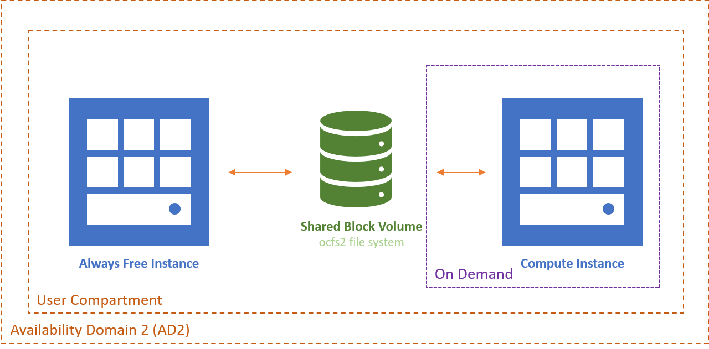

---
output:
  pdf_document: default
  html_document: default
---
<p align = "right"><i>Created by PJ Van Camp <br>Date created: 10 November 2020<br>
Last update: 11 November 2020</i></p>

<br>

# Tips on how to use the Oracle Cloud Infrastructure (OCI) Command Line Interface (CLI)
___

## Introduction
The Oracle Cloud Infrastructure (OCI) allows people to create computing instances in the cloud with custom operating systems and hardware specifications (e.g. CPU and RAM) to perform high demanding tasks or set-up a remote service. The Command Line Interface (CLI) allows for configuration of these instances without the need for the default web-interface and can be run from any connected terminal.

In this guide, some of the basics of the CLI in Linux-based systems are explained and examples given. Of note, this guide is not created by Oracle nor a comprehensive introduction, and the [official documentation](https://docs.cloud.oracle.com/en-us/iaas/Content/home.htm) should be consulted in case of questions or issues.

___

## Things you should be familiar with before starting
### Setting up an instance
* If this is the first time using OCI (nothing configured yet) read the [first time guide](https://docs.cloud.oracle.com/en-us/iaas/Content/GSG/Reference/overviewworkflow.htm#Tutorial__Launching_Your_First_Linux_Instance)
* Manual procedure of launching an instance through the web interface is detailed in [this guide](https://docs.cloud.oracle.com/en-us/iaas/Content/GSG/Tasks/launchinginstance.htm#Launching_a_Linux_Instance)

*Note: This guide makes use of the 'always free' instance tier provided by OCI, which is only available on availability domain 2 (AD2) for now*

### Creating a block volume
A block volume is a storage volume that is not part of the OS image, but can be attached to any instance separately. It is not to be confused with a boot volume, which is an image of a previously run instance that was saved when terminated (and holds an operating system). 
For the general procedure on how to create a new block volume, [read this guide](https://docs.cloud.oracle.com/en-us/iaas/Content/GSG/Tasks/addingstorage.htm)

### Creating custom images
Instances can be run with custom operating system images that were created from previous instances. For details, [read this guide](https://docs.cloud.oracle.com/en-us/iaas/Content/Compute/Tasks/managingcustomimages.htm)

___

## Preparations for using CLI
### Goal 
In this setup, we will make use of the 'always free' instance to have a base instance that is always running and from which another instance with a shared block volume is launched. This will save money by only running a more powerful instance when needed whilst minimising the time needed to launch and terminate them. By using the CLI from the free instance, we can automate the whole process without the need for going through the web-interface.

With this setup, the instance we launch on demand can read/write data to the shared volume which can be accessed at any time from the free instance (which is connected to the same volume). This way, we can dispose of the compute instance after it finished its work, and still keep the results readily available without having a large idle instance.


*NOTE: In this setup, it's only possible to launch one instance at the time that is connected to the shared block volume. By donig this, we can simplify some of the steps needed for automation*

### STEP 1 - Create and set-up the always free instance
* This step is still done manually though the web-interface, as we assume there are no other instances running yet. Read 'setting up an instance' above if you don't know how to start
* Choose a name for your instance (e.g. alwaysFree) and pick the compartment you want to set it up in. Beware that this setup only works within one compartment.
* Pick the operating system image of your preference (default is OK, but otherwise make sure it is "Always Free Eligible")
* The always free instance shape is **only available under availability domain 2 (AD2)** and can be found under the 'Specialty & Legacy' shapes
* Keep all other setting to the default (or change only if you now what you are doing) and don't forget to download the SSH key

Once you have created the instance, copy the external IP address and connect to it from a remote terminal with SSH using the key you downloaded. The default root users will be opc if you did not use a custom image.

```
ssh -i "alwaysFree.key" opc@<external-ip>
```

You can now modify the OS to your wishes, for example adding users or changing the way you can authenticate (e.g. password based instead of with key). Details are beyond the scope of this tutorial, since this is all optional.

### STEP 2 - Creating a block volumne with shared file system (ocfs2)
Once you have the free instance instance running, you can attach a new block volume to it and mount it as a dive. In this setup we will create a block volume that is attached to the free instance but will also attach to the other instance when launched on demand. This way, all data written to the shared dive can be accessed from the free instance even if the other instance is not running. Do not worry yet about creating the other instance, but just set everything up on the free instance first.

* This guide does not detail creating a *new* block volume with CLI, so follow the tips in the first section on how to set one up through the web-interface 
* The first time, we will attach the block volume to the free instance through the web-interface. When asked how you like to attach the volume, choose "shared read-write" and just acknowledge the warning to setup a proper shared file system
* Don't forget to run the provided commands on the free instance after attaching the block volume, or it won't be found
* The OCFS file system allows drives to be shared between different machines and prevents data corruption from reading / writing by monitoring the actions taken by different machines. 

### Installing ocfs2
*Ignore if you use Oracle Linux*

If you choose Oracle Linux as your linux distribution, OCFS2 is already pre-installed on your machine. If you use other Linux distributions (e.g. CentOs) you need to install both the kernel and packages to make sure that OCFS can be used

Setting up OCFS 2 on a non-Oracle-Linux system (example here CentOs)
```
# Add the orcale repositories to your system
cd /etc/yum.repos.d
wget http://public-yum.oracle.com/public-yum-ol7.repo

cd /etc/pki/rpm-gpg/
wget http://public-yum.oracle.com/RPM-GPG-KEY-oracle-ol7
rpm --import /etc/pki/rpm-gpg/RPM-GPG-KEY-oracle-ol7

#Install ocfs2 kernel and tools
yum install kernel-uek ocfs2
yum install -y ocfs2-tools
```

### Before you start configuration
Get the alwaysFree internal IP

* Use the web-interface and look at your running instance
* Or run the following command on the freeInstance termnial: `hostname -I`  
* The IP address look something like 10.0.0.1 (numbers can vary)

Choose a fixed internal IP / hostname for the computeInstance

* Since in this setup, there will only be one active instance at any time connected to the block volume apart from the alwaysFree, we can use the same local IP address every time we launch the instance (af the previous instance will have to be terminated before you can launch another one). 
* Pick any local IP address that has not been assignes to an instance yet. If you only have the freeInstance running at the moment, you can just pick any of the IP addressed before or after that one. In this example we'll use 10.0.0.2. To check your IP address is not being used in the network, you can run `arp -n` and ensure it's not in the list.
* The same goes for the hostname, in this example we choose it to be "computeInstance"

### Configure ocfs2 for the first time
Follow [this guide](https://blogs.oracle.com/cloud-infrastructure/using-the-multi-attach-block-volume-feature-to-create-a-shared-file-system-on-oracle-cloud-infrastructure) on how to configure ocfs2 for the first time on your shared drive with these additional notes:

* The firewall configuration needs to be done in two places. One is on your Linux instance itself (see section in guide on Ports) and the other one on the Oracle web-interface. Networking -> Virtual Cloud Networks -> Subnets -> Security Lists. There, add 2 Ingress Rules for port 3260 and 7777: TCP, SOURCE CIDR 0.0.0.0/0, DESTINATION PORT RANGE 3260 or 7777. Rest stays blank or default
* When creating the cluster.conf file, use the internal IP and hostname of your instances (see previous section).


```
cluster:
	heartbeat_mode = local
	node_count = 2
	name = myProject

node:
	number = 0
	cluster = myProject
	ip_port = 7777
	ip_address = 10.0.0.1
	name = alwaysFree

node:
	number = 1
	cluster = myProject
	ip_port = 7777
	ip_address = 10.0.0.2
	name = computeInstance
```

### STEP 3 - Setting up the other compute instance
We are almost ready to launch a custom instance, but we need to have a (custom) image of an operating system to launch. In this section we'll create that image and make sure everyting is set-up to work with the ocfs2 cluster

* The fist time it's easiest to create the new instance manually through the web-interface, just like we did with the free instance. Then you can configure it with everything that's needed for your personal goals (installing software and setting up various system settings).
* **Make sure to save the private key file and copy it to your always free instance** as you will need it to login from the free instance into the new instance in future. Here, we named the key "computeInstance.key". Alternatively, you can setup other ways of authentication like password based (beyond the scope of this tutorial)
* Install ocfs2 on the new instance as well if needed (see previous part) and copy the cluster.conf file from the freeInstance to this one. You do NOT need to follow the steps for formatting the drive as this only needs to be one once and has been done in the previous step. Also, do not try to attach the drive yet, as this instance likely has a different internal IP and hostname. Just make sure the confif file is in place.
* Once everything has been set-up, [create an image](https://docs.cloud.oracle.com/en-us/iaas/Content/Compute/Tasks/managingcustomimages.htm) from this instance and then terminate the instance. You are now left with just the free instance running. You can delete the boot volume of this instance as from now on we'll use the image we just created
* At any time, you can change the image you like by loading it, editing and creating a new image or simple starting from scratch

___

## Using CLI to launch the instance
Now we have a free instance running, a shared drive with ocfs2 file system (currently attached to the freeInstance) and an image of another instance, we are ready to launch that image from the CLI and attach the shared drive (block volume) to it. 

### Get all necessary IDs (resource identifiers)
Before we start writing the script, we need to find some IDs that are needed in order for this to work

* **Tenancy ID**: Click your account icon (top-right) on the Oracle Cloud web-interface and choose 'Tenancy'. The, copy paste the OCID from the tenancy information. It should start with 'ocid1.tenancy ...'
* **Compartment ID**: On the Oracle Cloud web-interface go to the main menu (left) then Identity -> Compartments and click the compartment in which you created the free instance. There copy the OCID. It should start with 'ocid1.compartment ...'
* **Boot volume ID**: On the Oracle Cloud web-interface go to the main menu (left) then Block Storage -> Block Volumes and click the block volume you created in the previous step and attached to the free instance. There copy the OCID. It should start with 'ocid1.volume ...'. You can double check it's attached to the free instance in the menu on the left.
* **Image (of instance) ID**: On the Oracle Cloud web-interface go to the main menu (left) then Instances -> Custom Images and click the name of the image you created from the instance we set-up in the previous step and will be launched from the CLI. There copy the OCID. It should start with 'ocid1.image ...'
* **Subnet Id**: On the Oracle Cloud web-interface go to the main menu (left) then Networking -> Virtual Cloud Networks -> vcn-... (there should only be one VCN) -> Public Subnet. There copy the OCID. It should start with 'ocid1.subnet ...' 

### Pick an instance shape configuration
Look at the list of all shapes you can choose from when creating a new instance through the web insterface (Instances -> Create Instance -> Edit Configure placement and hardware -> Change Shape), and pick one that you are interested in in using (e.g. VM.Standard2.4)

Alternatively, you can run the following CLI command on your free instance to list all available shapes as a JSON file. You will need your compartment ID for this (see above)
```
oci compute shape list --compartment-id <put OCID here>

{
  "data": [
    {
      "gpu-description": null,
      "gpus": 0,
      "local-disk-description": null,
      "local-disks": 0,
      "local-disks-total-size-in-gbs": null,
      "max-vnic-attachment-options": null,
      "max-vnic-attachments": 200,
      "memory-in-gbs": 768.0,
      "memory-options": null,
      "networking-bandwidth-in-gbps": 50.0,
      "networking-bandwidth-options": null,
      "ocpu-options": null,
      "ocpus": 52.0,
      "processor-description": "2.0 GHz Intel\u00ae Xeon\u00ae Platinum 8167M (Skylake)",
      "shape": "BM.Standard2.52"
    },
    {
      "gpu-description": null,
      "gpus": 0,
      "local-disk-description": null,
      "local-disks": 0,
      "local-disks-total-size-in-gbs": null,
      "max-vnic-attachment-options": null,
      "max-vnic-attachments": 256,
      "memory-in-gbs": 2048.0,
      "memory-options": null,
      "networking-bandwidth-in-gbps": 100.0,
      "networking-bandwidth-options": null,
      "ocpu-options": null,
      "ocpus": 128.0,
      "processor-description": "2.25 GHz AMD EPYC\u2122 7742 (Rome)",
      "shape": "BM.Standard.E3.128"
    },
    
    ...
```
The "shape" line contains the name you can use to launch it

### Launch an instance
We finally have all information needed to launch and instance from the CLI. We choose the "VM.Standard2.4" shape for this example, but can be changed of course.
```
oci compute instance launch \
	--availability-domain "uNZJ:US-ASHBURN-AD-2" \
	--compartment-id <put OCID here> \
	--shape "VM.Standard2.4" \
	--hostname-label <put hostname here> \
	--display-name "computeInstancee" \
	--image-id <put OCID here> \
	--subnet-id <put OCID here> \
	--private-ip <put private IP here>
```
Put in all the IDs you gathered in the previous steps. The availability-domain should be "uNZJ:US-ASHBURN-AD-2" as this is the only one with the free instance available. The private-ip and the hostname-label "computeInstance" should be identical to the once you provided in the ocfs2 config file for this instance. In our example this should be 10.0.0.2 and "computeInstance"

If successful, the command will return a JSON file with the details on the new instance. Save this or take note of the new instance OCID 'ocid1.instance ...'. You can always check the details through the the web-interface as it should be visible on there as well now. It will take a while before the instance is running, after which we can attach the block volume

### Attach the block volume
With the new instance ID an the known block volume ID, we can now attach the block volume to the newly launched instance
```
oci compute volume-attachment attach \
	--instance-id <put OCID here> \
	--type iscsi \
	--volume-id <put OCID here> \
	--is-shareable true \
	--device "/dev/oracleoci/oraclevdb"
```
This again will return a JSON file if successful with information we will need to mount the instance to the new system (remember, attaching is not the same as mounting). Grab the "ipv4", "iqn" and IP address values. You can now login to the newly launched instance from your free instance with the local IP, or from any other terminal with the public IP. You will need to have a copy of the new instance's private key file which you should have saved on the free instance while creating the new one (see previous sections) in order for the login to work. Here we login with the default opc user, but of course this can be changed depending on how you configured your image.
```
ssh -i "computeInstance.key" opc@<computeInstance IP>
```
You now successfully launched an instance from the free instance, and logged in to it

In the final step, we need to complete the attaching process and mount the drive so it can be used. You will need to run the following commands (the same as you would need to run when attaching a block volume through the web interface) with the ipv4 and iqn values you extracted from the JSON when attaching the drive. Finally you restart the ocfs2 server and mount the drive
```
ipv4=<put ipv4 here>
iqn=<put iqn here>
sudo iscsiadm -m node -o new -T $iqn -p $ipv4:3260 \
sudo iscsiadm -m node -o update -T $iqn -n node.startup -v automatic \
sudo iscsiadm -m node -T $iqn -p $ipv4:3260 -l
sudo /sbin/service o2cb restart
sudo mount -a
```
If all went well, you can now access the shared drive from your newly launches instance AND your free instance at the same time

### Terminate an instance
The same concept here. We use the OCID from the running 'computeInstance' to terminate it. 'The preserve-boot-volume' can be set to either true or false depending on whether you like to save the changes made to the boot volume or not, respectively. If possible, the most convenient method is to save all new data generated by the computeInstance to the shared drive. That way, no new data has been written to the launched volume and we can delete it when terminated, as the original image from which is was launched is still there and will be used next time. If the boot volume is saved, it will take up space on the Oracle cloud which costs money depending on the size and subscription you have. Remember, every instance that is terminated without deleting the volume, will store an extra 47GB (default boot volume size if not changed).
```
oci compute instance terminate \
		--instance-id <put OCID here> \
		--preserve-boot-volume <true/false>
```
___

## Putting everything together to fully automate the different steps
With all of the previous knowledge, we can create a script to launch and terminate an instance in one go saving a lot of time.

\<put scripts here or link to them\>

___
